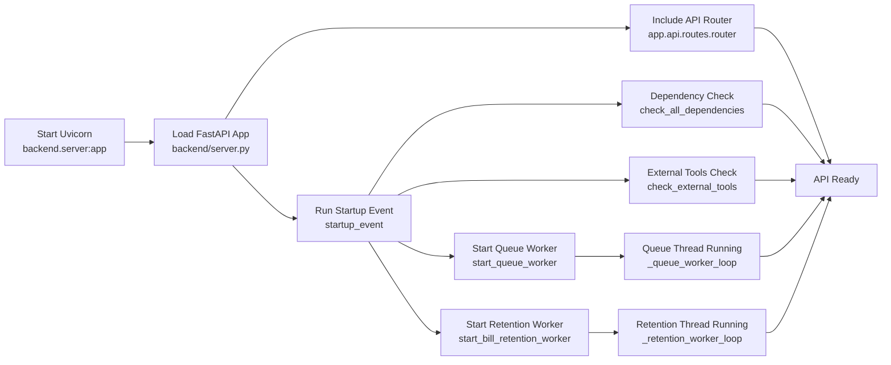
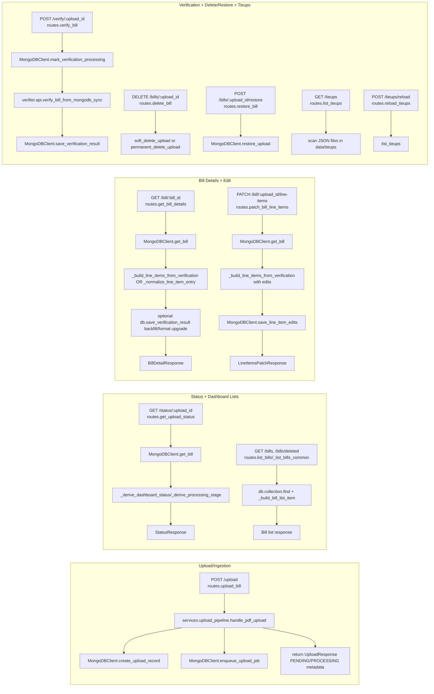
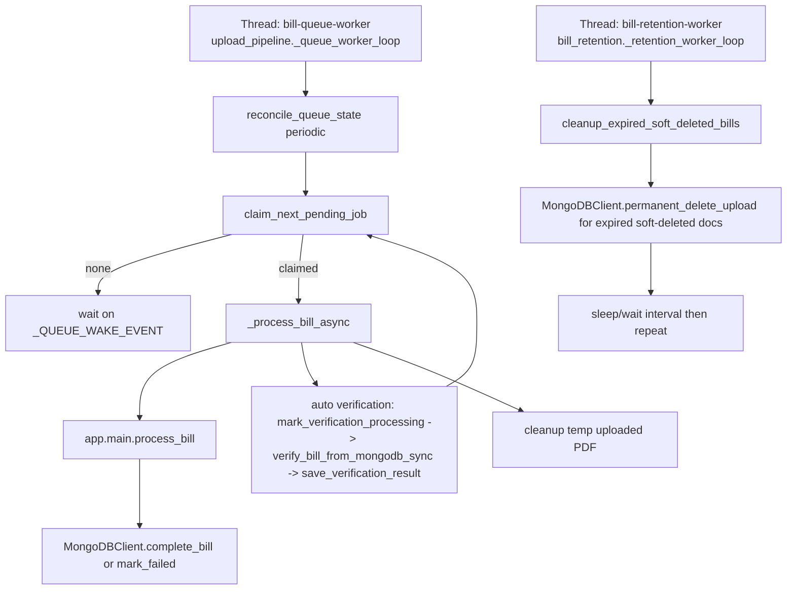
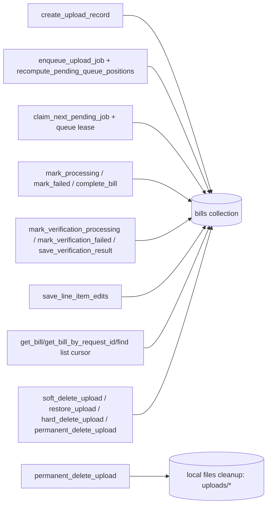

# BACKEND WORKFLOW

## 1) High-level architecture summary (5-10 bullets)
- Primary HTTP app bootstraps in `backend/server.py` (`app = FastAPI(...)`), includes router from `backend/app/api/routes.py`, and registers startup hook `startup_event()`.
- Startup hook `backend/server.py::startup_event` runs dependency checks (`app/utils/dependency_check.py`) and starts two daemon workers: queue worker (`app/services/upload_pipeline.py::start_queue_worker`) and retention worker (`app/services/bill_retention.py::start_bill_retention_worker`).
- Primary ingestion path is asynchronous queue-based: `POST /upload` -> `app/services/upload_pipeline.py::handle_pdf_upload` enqueues job; background thread `_queue_worker_loop` claims and processes jobs FIFO.
- Core extraction pipeline lives in `backend/app/main.py::process_bill`, which calls `pdf_to_images` -> `preprocess_image` -> `run_ocr` -> `extract_bill_data` -> `MongoDBClient.complete_bill`.
- Verification is executed automatically in background upload flow (`upload_pipeline.py::_process_bill_async`) and can also be triggered explicitly via `POST /verify/:upload_id` in `backend/app/api/routes.py::verify_bill`.
- Data lifecycle/state is persisted in MongoDB by `backend/app/db/mongo_client.py`; this file owns status transitions, queue positions, verification flags, line-item edit persistence, soft delete/restore/permanent delete.
- Response normalization for dashboard/status/details happens in `backend/app/api/routes.py` through helper functions (`_derive_dashboard_status`, `_normalize_queue_status`, `_derive_processing_stage`, `_format_verification_result_text`, `_build_line_items_from_verification`).
- There is a second FastAPI app at `backend/app/verifier/api.py` (legacy/alternate API surface). Primary production app (current path) is `backend/server.py` + `backend/app/api/routes.py`.
- Scheduled/periodic behavior exists via daemon threads only: queue reconciliation in `upload_pipeline.py::_queue_worker_loop` and retention cleanup in `bill_retention.py::_retention_worker_loop`.

## 2) Mermaid diagram(s)

### App startup flow

### Request lifecycle flow per endpoint group

### Async/background worker flow

### Data persistence flow (DB read/write paths)

## 3) Endpoint-to-handler-to-service mapping table

| Endpoint | Method | Router Function | Service/Domain Function(s) | DB Function(s) | Response Model |
|---|---|---|---|---|---|
| `/health` | GET | `backend/server.py::health_check` | None | None | Inline dict |
| `/` | GET | `backend/server.py::root` | None | None | Inline dict |
| `/upload` | POST | `backend/app/api/routes.py::upload_bill` | `backend/app/services/upload_pipeline.py::handle_pdf_upload` | `MongoDBClient.get_bill_by_request_id`, `create_upload_record`, `enqueue_upload_job`, `get_bill` | `UploadResponse` |
| `/status/:upload_id` | GET | `backend/app/api/routes.py::get_upload_status` | `_derive_dashboard_status`, `_normalize_queue_status`, `_derive_processing_stage`, `_is_bill_details_ready` | `MongoDBClient.get_bill` | `StatusResponse` |
| `/bills` | GET | `backend/app/api/routes.py::list_bills` -> `_list_bills_common` | `_build_bill_list_item`, `_parse_* filters` | Direct `db.collection.find(...)` cursor | `BillListItem[]` |
| `/bills/deleted` | GET | `backend/app/api/routes.py::list_deleted_bills` -> `_list_bills_common` | Same as above | Same as above | `BillListItem[]` |
| `/bills/:upload_id` | DELETE | `backend/app/api/routes.py::delete_bill` | Delete policy logic (soft vs permanent) | `get_bill`, `soft_delete_upload`, `permanent_delete_upload` | `DeleteBillResponse` |
| `/bill/:upload_id` | DELETE | `backend/app/api/routes.py::delete_bill_legacy` | Legacy alias, delegates to `delete_bill` | Same as above | `DeleteBillResponse` |
| `/bills/:upload_id/restore` | POST | `backend/app/api/routes.py::restore_bill` | Restore policy logic | `get_bill`, `restore_upload` | `RestoreBillResponse` |
| `/bill/:bill_id` | GET | `backend/app/api/routes.py::get_bill_details` | `_build_line_items_from_verification`, `_normalize_line_item_entry`, `_format_verification_result_text` | `get_bill`, optional `save_verification_result` | `BillDetailResponse` |
| `/bill/:upload_id/line-items` | PATCH | `backend/app/api/routes.py::patch_bill_line_items` | `_category_item_counts`, `_line_item_edits_map`, `_build_line_items_from_verification` | `get_bill`, `save_line_item_edits` | `LineItemsPatchResponse` |
| `/verify/:upload_id` | POST | `backend/app/api/routes.py::verify_bill` | `backend/app/verifier/api.py::verify_bill_from_mongodb_sync`, `_format_verification_result_text`, `_build_line_items_from_verification` | `get_bill`, `mark_verification_processing`, `save_verification_result`, `mark_verification_failed` | Raw dict (no response_model declared) |
| `/tieups` | GET | `backend/app/api/routes.py::list_tieups` | Filesystem scan + JSON parse | None | `TieupHospital[]` |
| `/tieups/reload` | POST | `backend/app/api/routes.py::reload_tieups` | Calls `list_tieups` | None | Inline dict |

### Legacy/alternate API surface (not included in primary server router)
| Endpoint | Method | Router Function | Service/Domain Function(s) | DB Function(s) | Response Model |
|---|---|---|---|---|---|
| `/upload` | POST | `backend/app/verifier/api.py::upload_and_process_bill` | `handle_pdf_upload` (signature mismatch risk) | `get_bill_by_upload_id` | `UploadResponse` (legacy model) |
| `/status/:upload_id` | GET | `backend/app/verifier/api.py::get_upload_status` | local normalization map | `get_bill` | `StatusResponse` (legacy model) |
| `/verify` | POST | `backend/app/verifier/api.py::verify_bill_direct` | `BillVerifier.verify_bill` | None | `VerificationResponse` (verifier model) |
| `/verify/:upload_id` | POST | `backend/app/verifier/api.py::verify_bill_from_mongodb` | `transform_mongodb_bill_to_input`, `BillVerifier.verify_bill` | `get_bill_by_upload_id` | `VerificationResponse` |
| `/tieups` | GET | `backend/app/verifier/api.py::list_tieups` | reads matcher index | None | Inline dict |
| `/tieups/reload` | POST | `backend/app/verifier/api.py::reload_tieups` | `load_all_tieups`, `verifier.initialize` | None | `ReloadResponse` |

## 4) File execution order (major user journeys)

### Upload/ingestion (primary path)
1. `backend/server.py` receives `POST /upload` routed to `backend/app/api/routes.py::upload_bill`.
2. `upload_bill` validates form via `UploadRequestForm` and calls `backend/app/services/upload_pipeline.py::handle_pdf_upload`.
3. `handle_pdf_upload` computes idempotency (`_build_ingestion_request_id`), checks duplicate via `MongoDBClient.get_bill_by_request_id`, and writes/creates record via `MongoDBClient.create_upload_record`.
4. `handle_pdf_upload` stores temp PDF (`UPLOADS_DIR`) and queues work via `MongoDBClient.enqueue_upload_job`, then wakes queue worker.
5. Background thread `upload_pipeline.py::_queue_worker_loop` claims FIFO work via `MongoDBClient.claim_next_pending_job`.
6. Claimed job executes `upload_pipeline.py::_process_bill_async` -> `backend/app/main.py::process_bill`.
7. `process_bill` pipeline: `pdf_to_images` (`backend/app/ingestion/pdf_loader.py`) -> `preprocess_image` (`backend/app/ocr/image_preprocessor.py`) -> `run_ocr` (`backend/app/ocr/paddle_engine.py`) -> `extract_bill_data` (`backend/app/extraction/bill_extractor.py`).
8. Persistence transition happens in `MongoDBClient.complete_bill`; failures go through `MongoDBClient.mark_failed`.
9. Same background flow then runs auto verification: `mark_verification_processing` -> `verify_bill_from_mongodb_sync` (`backend/app/verifier/api.py`) -> `save_verification_result` (format_version `legacy`, empty text initially).
10. Temp uploaded PDF is deleted in `_process_bill_async` finally block.

Status transitions and writers in this journey:
- `PENDING`: `MongoDBClient.create_upload_record`, `enqueue_upload_job` (`backend/app/db/mongo_client.py`).
- `PROCESSING`: `claim_next_pending_job` (queue claim write) and also `mark_processing` in `process_bill` for non-queue callers.
- `COMPLETED`: `MongoDBClient.complete_bill`.
- `FAILED`: `MongoDBClient.mark_failed`.
- Verification `processing/completed/failed`: `mark_verification_processing`, `save_verification_result`, `mark_verification_failed`.

### Status polling
1. `GET /status/:upload_id` -> `backend/app/api/routes.py::get_upload_status`.
2. Reads doc via `MongoDBClient.get_bill`.
3. Normalizes output through `_derive_dashboard_status`, `_normalize_queue_status`, `_is_bill_details_ready`, `_derive_processing_stage`, `_derive_processing_time_seconds`.
4. Returns `StatusResponse`.

### List/dashboard data
1. `GET /bills` or `GET /bills/deleted` -> `list_bills` / `list_deleted_bills` -> `_list_bills_common`.
2. Query filters parsed (`_parse_scope`, `_parse_status_filter`, `_get_date_window`, `_matches_hospital`).
3. Reads documents directly via `db.collection.find(...).sort("updated_at", -1)`.
4. Per-document normalization/model conversion in `_build_bill_list_item`.
5. Returns `BillListItem[]`.

### Bill details
1. `GET /bill/:bill_id` -> `get_bill_details`.
2. Reads document via `MongoDBClient.get_bill`; deleted docs are hidden.
3. Computes readiness/status via `_derive_dashboard_status`, `_is_bill_details_ready`.
4. Builds line items from either stored `line_items` (`_normalize_line_item_entry`) or verification payload (`_build_line_items_from_verification`).
5. If verification text missing/non-v1, converts payload to parser-safe text with `_format_verification_result_text` and persists normalized payload via `MongoDBClient.save_verification_result`.
6. Returns `BillDetailResponse`.

Response normalization/model conversion points in this journey:
- `_normalize_line_item_entry` converts stored legacy/new line item fields into consistent `BillLineItem` structure.
- `_build_line_items_from_verification` builds frontend table rows from verification payload + source bill items + edits.
- `_format_verification_result_text` converts structured verification object into stable text contract (`formatVersion v1`).

### Verification
Primary path (automatic):
1. Queue worker (`upload_pipeline.py::_process_bill_async`) finishes extraction.
2. Calls `MongoDBClient.mark_verification_processing`.
3. Calls `backend/app/verifier/api.py::verify_bill_from_mongodb_sync`.
4. `verify_bill_from_mongodb_sync` reads bill (`fetch_bill_from_mongodb`) and converts schema (`transform_mongodb_bill_to_input`) then runs `BillVerifier.verify_bill` (`backend/app/verifier/verifier.py`).
5. Stores verification via `MongoDBClient.save_verification_result`.

Explicit/manual path:
1. `POST /verify/:upload_id` -> `backend/app/api/routes.py::verify_bill`.
2. `mark_verification_processing` then same verifier sync call.
3. Route-level formatting and normalization: `_format_verification_result_text`, `_build_line_items_from_verification`.
4. Persist via `save_verification_result`; on error `mark_verification_failed`.

### Edit/update paths
1. `PATCH /bill/:upload_id/line-items` -> `patch_bill_line_items`.
2. Reads bill via `MongoDBClient.get_bill`; verifies verification payload exists.
3. Validates category/index against `_category_item_counts` and `_category_name_lookup`.
4. Merges edits with existing edits map (`_line_item_edits_map`).
5. Recomputes line items from verification + edits (`_build_line_items_from_verification`).
6. Persists via `MongoDBClient.save_line_item_edits`.
7. Returns `LineItemsPatchResponse`.

### Delete/restore paths
Soft delete:
1. `DELETE /bills/:upload_id` with `permanent=false` -> `delete_bill`.
2. Reads bill with `get_bill`.
3. Writes soft delete marker via `soft_delete_upload` (`is_deleted=true`, `deleted_at`, audit fields).

Permanent delete:
1. Same route with `permanent=true`.
2. If active, auto soft-deletes first.
3. Executes `permanent_delete_upload` (internally `hard_delete_upload` + local file cleanup `_cleanup_upload_files`).

Legacy delete alias:
- `DELETE /bill/:upload_id` -> `delete_bill_legacy` delegates to `delete_bill`.

Restore:
1. `POST /bills/:upload_id/restore` -> `restore_bill`.
2. Reads bill then `restore_upload` clears delete markers.
3. Re-reads and normalizes with `_build_bill_list_item`.

## 5) Internal module dependency map

### API layer
- Primary app entry: `backend/server.py`.
- Route handlers: `backend/app/api/routes.py`.
- Depends on:
  - Services: `backend/app/services/upload_pipeline.py`.
  - DB: `backend/app/db/mongo_client.py`.
  - Verification facade: `backend/app/verifier/api.py::verify_bill_from_mongodb_sync`.
  - Local response-normalization helpers in same file.

### Services layer
- `backend/app/services/upload_pipeline.py` orchestrates queued ingestion + auto verification.
- `backend/app/services/bill_retention.py` handles retention cleanup loop.
- Depends on:
  - Core processing: `backend/app/main.py::process_bill`.
  - DB lifecycle methods in `mongo_client.py`.
  - Config constants in `backend/app/config.py`.

### Extraction/OCR layer
- OCR ingestion: `backend/app/ingestion/pdf_loader.py`, `backend/app/ocr/image_preprocessor.py`, `backend/app/ocr/paddle_engine.py`.
- Structured extraction: `backend/app/extraction/bill_extractor.py` with helper modules (`column_parser.py`, `zone_detector.py`, `section_tracker.py`, `numeric_guards.py`, `regex_utils.py`).
- Called from `backend/app/main.py::process_bill`.

### Verification layer
- Facade/adapters: `backend/app/verifier/api.py` (`verify_bill_from_mongodb_sync`, transform functions).
- Core verification engine: `backend/app/verifier/verifier.py::BillVerifier.verify_bill`.
- Depends on matcher/price/financial modules:
  - `backend/app/verifier/matcher.py`
  - `backend/app/verifier/price_checker.py`
  - `backend/app/verifier/financial_contribution.py`
  - model schemas in `backend/app/verifier/models.py`

### DB layer
- `backend/app/db/mongo_client.py` is canonical DB gateway for runtime operations.
- Schema/guardrails/index helpers:
  - `backend/app/db/bill_schema.py`
  - `backend/app/db/artifact_filter.py`
  - `backend/app/db/init_indexes.py` (manual/operational, not wired into primary startup).

## 6) Risks/gaps

### Dead code / duplicate routes / alternate legacy paths
- Duplicate delete routes: `DELETE /bills/:upload_id` (primary) and `DELETE /bill/:upload_id` (`delete_bill_legacy`) in `backend/app/api/routes.py`.
- Duplicate API app surfaces: primary app is `backend/server.py`; alternate/legacy app exists at `backend/app/verifier/api.py` with overlapping endpoints (`/upload`, `/status`, `/verify`, `/tieups`).
- Legacy DB methods still present: `MongoDBClient.insert_bill` and `MongoDBClient.upsert_bill` are not used in primary runtime ingestion path (primary uses `create_upload_record` + `complete_bill`).
- `backend/app/db/init_indexes.py::ensure_indexes` is not called in primary startup hook (`backend/server.py::startup_event`), so index management depends on external/manual execution.

### Potential race/concurrency conditions
- Queue worker enforces single processing using both queue lease (`_acquire_queue_lease`) and active-processing check in `claim_next_pending_job`; this is good, but still relies on document status consistency and lease updates under process failures.
- Manual `POST /verify/:upload_id` can run while auto-verification flow is active; `mark_verification_processing` prevents some duplicate state changes but does not fully serialize two verify callers if they both proceed after reads.
- Details endpoint (`GET /bill/:bill_id`) can write back (`save_verification_result`) for format backfill; this introduces write-on-read behavior and possible last-write-wins interactions with concurrent edits/verification.

### Data/behavior consistency gaps
- `backend/app/extraction/bill_extractor.py` still injects a `"Hospital - "` category into extracted items, while `backend/app/db/artifact_filter.py::validate_bill_items` flags `"Hospital - "` as invalid. In `complete_bill`, this only logs validation failure and continues; behavior is inconsistent.
- In `backend/app/verifier/api.py::upload_and_process_bill`, `handle_pdf_upload` is called without `employee_id` argument (required by signature in `backend/app/services/upload_pipeline.py`), indicating this route path is stale/broken unless code diverged at runtime.
- Status normalization occurs in multiple places (primary `routes.py` and legacy `verifier/api.py`) with slightly different mappings, which can cause inconsistent UI state labels across paths.

## 7) Final deliverable
- This document is generated from code inspection of:
  - `backend/server.py`
  - `backend/app/api/routes.py`
  - `backend/app/services/upload_pipeline.py`
  - `backend/app/services/bill_retention.py`
  - `backend/app/main.py`
  - `backend/app/db/mongo_client.py`
  - `backend/app/ingestion/pdf_loader.py`
  - `backend/app/ocr/image_preprocessor.py`
  - `backend/app/ocr/paddle_engine.py`
  - `backend/app/extraction/bill_extractor.py`
  - `backend/app/verifier/api.py`
  - `backend/app/verifier/verifier.py`
  - `backend/app/config.py`
  - `backend/app/db/artifact_filter.py`
  - `backend/app/db/init_indexes.py`

- Primary path label: `backend/server.py` + `backend/app/api/routes.py`.
- Legacy/fallback labels included where alternate implementations exist.

## 8) Complete file accountability catalog

Total files accounted for in this workspace snapshot (excluding `__pycache__`/`.pyc`): **200**.

Simple format used below:
- What this file does: plain-language purpose
- When it is called: runtime/test/manual trigger
- Input source files: exact file names that feed this file
- Input source details: how input is consumed
- Output destination files: exact file names that receive this file's output
- Output destination details: how output is forwarded/used

### `backend\__init__.py`
- What this file does: Python source module supporting backend behavior.
- When it is called: When imported/executed by active path.
- Input source files: `backend\__init__.py`, `backend\server.py`
- Input source details: Consumes caller arguments and imported module data.
- Output destination files: `backend\app\api\routes.py`, `backend\app\db\mongo_client.py`
- Output destination details: Returns values/side effects consumed by caller.

### `backend\app\__init__.py`
- What this file does: Python source module supporting backend behavior.
- When it is called: When imported/executed by active path.
- Input source files: `backend\app\__init__.py`, `backend\server.py`
- Input source details: Consumes caller arguments and imported module data.
- Output destination files: `backend\app\api\routes.py`, `backend\app\db\mongo_client.py`
- Output destination details: Returns values/side effects consumed by caller.

### `backend\app\api\__init__.py`
- What this file does: Python source module supporting backend behavior.
- When it is called: When imported/executed by active path.
- Input source files: `backend\app\api\__init__.py`, `backend\server.py`
- Input source details: Consumes caller arguments and imported module data.
- Output destination files: `backend\app\api\routes.py`, `backend\app\db\mongo_client.py`
- Output destination details: Returns values/side effects consumed by caller.

### `backend\app\api\routes.py`
- What this file does: Main HTTP controller layer with endpoint logic and response shaping.
- When it is called: On every matching API request.
- Input source files: `backend\server.py`, `backend\app\api\routes.py`, `backend\app\db\mongo_client.py`, `backend\app\services\upload_pipeline.py`
- Input source details: Consumes request payloads and backing DB/service data.
- Output destination files: `backend\app\services\upload_pipeline.py`, `backend\app\db\mongo_client.py`, `backend\app\verifier\api.py`
- Output destination details: Returns frontend JSON and triggers service/DB operations.

### `backend\app\classification\item_classifier.py`
- What this file does: Classification helper module.
- When it is called: When classification flow/tests import it.
- Input source files: `backend\app\classification\item_classifier.py`, `backend\app\extraction\bill_extractor.py`
- Input source details: Consumes item/category text context.
- Output destination files: `backend\app\extraction\bill_extractor.py`
- Output destination details: Returns classification signals to parser logic.

### `backend\app\config.py`
- What this file does: Python source module supporting backend behavior.
- When it is called: When imported/executed by active path.
- Input source files: `backend\app\config.py`, `backend\server.py`
- Input source details: Consumes caller arguments and imported module data.
- Output destination files: `backend\app\api\routes.py`, `backend\app\db\mongo_client.py`
- Output destination details: Returns values/side effects consumed by caller.

### `backend\app\db\artifact_filter.py`
- What this file does: Database support module.
- When it is called: When DB behavior in this scope is required.
- Input source files: `backend\app\db\mongo_client.py`, `backend\app\db\artifact_filter.py`
- Input source details: Consumes persistence/query context from callers.
- Output destination files: `backend\app\db\mongo_client.py`, `backend\app\api\routes.py`
- Output destination details: Returns DB-related structures/validation support.

### `backend\app\db\bill_schema.py`
- What this file does: Database support module.
- When it is called: When DB behavior in this scope is required.
- Input source files: `backend\app\db\mongo_client.py`, `backend\app\db\bill_schema.py`
- Input source details: Consumes persistence/query context from callers.
- Output destination files: `backend\app\db\mongo_client.py`, `backend\app\api\routes.py`
- Output destination details: Returns DB-related structures/validation support.

### `backend\app\db\init_indexes.py`
- What this file does: Database support module.
- When it is called: When DB behavior in this scope is required.
- Input source files: `backend\app\db\mongo_client.py`, `backend\app\db\init_indexes.py`
- Input source details: Consumes persistence/query context from callers.
- Output destination files: `backend\app\db\mongo_client.py`, `backend\app\api\routes.py`
- Output destination details: Returns DB-related structures/validation support.

### `backend\app\db\mongo_client.py`
- What this file does: Central MongoDB data access and lifecycle state manager.
- When it is called: Whenever routes/services/workers read or write persistent state.
- Input source files: `backend\app\api\routes.py`, `backend\app\services\upload_pipeline.py`, `backend\app\main.py`, `backend\app\services\bill_retention.py`
- Input source details: Receives lookup and update requests from runtime layers.
- Output destination files: `backend\app\api\routes.py`, `backend\app\services\upload_pipeline.py`, `backend\app\services\bill_retention.py`
- Output destination details: Returns DB documents/results and persists state transitions.

### `backend\app\db\tieup_rates_schema.py`
- What this file does: Database support module.
- When it is called: When DB behavior in this scope is required.
- Input source files: `backend\app\db\mongo_client.py`, `backend\app\db\tieup_rates_schema.py`
- Input source details: Consumes persistence/query context from callers.
- Output destination files: `backend\app\db\mongo_client.py`, `backend\app\api\routes.py`
- Output destination details: Returns DB-related structures/validation support.

### `backend\app\extraction\bill_extractor.py`
- What this file does: Extraction support module (zones/regex/amount guards/section parsing).
- When it is called: During extraction pipeline execution.
- Input source files: `backend\app\extraction\bill_extractor.py`, `backend\app\extraction\bill_extractor.py`
- Input source details: Consumes OCR lines/blocks and parse context.
- Output destination files: `backend\app\extraction\bill_extractor.py`
- Output destination details: Returns parsed pieces merged into final extracted bill.

### `backend\app\extraction\column_parser.py`
- What this file does: Extraction support module (zones/regex/amount guards/section parsing).
- When it is called: During extraction pipeline execution.
- Input source files: `backend\app\extraction\bill_extractor.py`, `backend\app\extraction\column_parser.py`
- Input source details: Consumes OCR lines/blocks and parse context.
- Output destination files: `backend\app\extraction\bill_extractor.py`
- Output destination details: Returns parsed pieces merged into final extracted bill.

### `backend\app\extraction\numeric_guards.py`
- What this file does: Extraction support module (zones/regex/amount guards/section parsing).
- When it is called: During extraction pipeline execution.
- Input source files: `backend\app\extraction\bill_extractor.py`, `backend\app\extraction\numeric_guards.py`
- Input source details: Consumes OCR lines/blocks and parse context.
- Output destination files: `backend\app\extraction\bill_extractor.py`
- Output destination details: Returns parsed pieces merged into final extracted bill.

### `backend\app\extraction\regex_utils.py`
- What this file does: Extraction support module (zones/regex/amount guards/section parsing).
- When it is called: During extraction pipeline execution.
- Input source files: `backend\app\extraction\bill_extractor.py`, `backend\app\extraction\regex_utils.py`
- Input source details: Consumes OCR lines/blocks and parse context.
- Output destination files: `backend\app\extraction\bill_extractor.py`
- Output destination details: Returns parsed pieces merged into final extracted bill.

### `backend\app\extraction\section_tracker.py`
- What this file does: Extraction support module (zones/regex/amount guards/section parsing).
- When it is called: During extraction pipeline execution.
- Input source files: `backend\app\extraction\bill_extractor.py`, `backend\app\extraction\section_tracker.py`
- Input source details: Consumes OCR lines/blocks and parse context.
- Output destination files: `backend\app\extraction\bill_extractor.py`
- Output destination details: Returns parsed pieces merged into final extracted bill.

### `backend\app\extraction\zone_detector.py`
- What this file does: Extraction support module (zones/regex/amount guards/section parsing).
- When it is called: During extraction pipeline execution.
- Input source files: `backend\app\extraction\bill_extractor.py`, `backend\app\extraction\zone_detector.py`
- Input source details: Consumes OCR lines/blocks and parse context.
- Output destination files: `backend\app\extraction\bill_extractor.py`
- Output destination details: Returns parsed pieces merged into final extracted bill.

### `backend\app\ingestion\pdf_loader.py`
- What this file does: Python source module supporting backend behavior.
- When it is called: When imported/executed by active path.
- Input source files: `backend\app\ingestion\pdf_loader.py`, `backend\server.py`
- Input source details: Consumes caller arguments and imported module data.
- Output destination files: `backend\app\api\routes.py`, `backend\app\db\mongo_client.py`
- Output destination details: Returns values/side effects consumed by caller.

### `backend\app\main.py`
- What this file does: Core processing pipeline: PDF to OCR to extracted bill to DB state transition.
- When it is called: When queue worker or CLI starts processing.
- Input source files: `backend\app\services\upload_pipeline.py`, `backend\main.py`, `backend\app\ingestion\pdf_loader.py`, `backend\app\ocr\image_preprocessor.py`, `backend\app\ocr\paddle_engine.py`, `backend\app\extraction\bill_extractor.py`
- Input source details: Consumes PDF path + helper outputs from ingestion/OCR/extraction modules.
- Output destination files: `backend\app\db\mongo_client.py`, `backend\app\utils\cleanup.py`
- Output destination details: Writes completed/failed bill state and performs artifact cleanup.

### `backend\app\ocr\batch_preprocessor.py`
- What this file does: OCR support module.
- When it is called: During OCR stages of processing.
- Input source files: `backend\app\main.py`, `backend\app\ocr\batch_preprocessor.py`
- Input source details: Consumes image paths and OCR params.
- Output destination files: `backend\app\main.py`, `backend\app\extraction\bill_extractor.py`
- Output destination details: Outputs OCR-ready artifacts/text structures to next stage.

### `backend\app\ocr\image_preprocessor.py`
- What this file does: OCR support module.
- When it is called: During OCR stages of processing.
- Input source files: `backend\app\main.py`, `backend\app\ocr\image_preprocessor.py`
- Input source details: Consumes image paths and OCR params.
- Output destination files: `backend\app\main.py`, `backend\app\extraction\bill_extractor.py`
- Output destination details: Outputs OCR-ready artifacts/text structures to next stage.

### `backend\app\ocr\paddle_engine.py`
- What this file does: OCR support module.
- When it is called: During OCR stages of processing.
- Input source files: `backend\app\main.py`, `backend\app\ocr\paddle_engine.py`
- Input source details: Consumes image paths and OCR params.
- Output destination files: `backend\app\main.py`, `backend\app\extraction\bill_extractor.py`
- Output destination details: Outputs OCR-ready artifacts/text structures to next stage.

### `backend\app\services\__init__.py`
- What this file does: Python source module supporting backend behavior.
- When it is called: When imported/executed by active path.
- Input source files: `backend\app\services\__init__.py`, `backend\server.py`
- Input source details: Consumes caller arguments and imported module data.
- Output destination files: `backend\app\api\routes.py`, `backend\app\db\mongo_client.py`
- Output destination details: Returns values/side effects consumed by caller.

### `backend\app\services\bill_retention.py`
- What this file does: Retention daemon for deleting expired soft-deleted records.
- When it is called: Periodic loop started during startup.
- Input source files: `backend\server.py`, `backend\app\db\mongo_client.py`, `backend\app\config.py`
- Input source details: Reads retention settings and deleted-record state.
- Output destination files: `backend\app\db\mongo_client.py`
- Output destination details: Sends permanent delete actions and logs retention stats.

### `backend\app\services\upload_pipeline.py`
- What this file does: Upload queue orchestration, worker loop, extraction trigger, and auto verification trigger.
- When it is called: On POST /upload and in background queue thread.
- Input source files: `backend\app\api\routes.py`, `backend\app\db\mongo_client.py`, `backend\app\main.py`, `backend\app\verifier\api.py`
- Input source details: Consumes upload form/file input and queued DB jobs.
- Output destination files: `backend\app\db\mongo_client.py`, `backend\app\main.py`, `backend\app\verifier\api.py`
- Output destination details: Writes lifecycle states and forwards jobs to extraction/verification.

### `backend\app\tools\__init__.py`
- What this file does: Developer tooling module.
- When it is called: Manual setup/build run.
- Input source files: `backend\app\tools\__init__.py`, `data\tieups\apollo_hospital.json`
- Input source details: Consumes local data/config inputs.
- Output destination files: `data\embedding_cache.json`
- Output destination details: Writes cache/artifact outputs used by runtime features.

### `backend\app\tools\build_embeddings.py`
- What this file does: Developer tooling module.
- When it is called: Manual setup/build run.
- Input source files: `backend\app\tools\build_embeddings.py`, `data\tieups\apollo_hospital.json`
- Input source details: Consumes local data/config inputs.
- Output destination files: `data\embedding_cache.json`
- Output destination details: Writes cache/artifact outputs used by runtime features.

### `backend\app\utils\__init__.py`
- What this file does: Shared utility helper module.
- When it is called: When imported by runtime callers.
- Input source files: `backend\app\utils\__init__.py`, `backend\app\main.py`
- Input source details: Consumes helper args from caller module.
- Output destination files: `backend\app\main.py`, `backend\app\services\upload_pipeline.py`
- Output destination details: Returns utility outputs or side effects.

### `backend\app\utils\cleanup.py`
- What this file does: Shared utility helper module.
- When it is called: When imported by runtime callers.
- Input source files: `backend\app\utils\cleanup.py`, `backend\app\main.py`
- Input source details: Consumes helper args from caller module.
- Output destination files: `backend\app\main.py`, `backend\app\services\upload_pipeline.py`
- Output destination details: Returns utility outputs or side effects.

### `backend\app\utils\dependency_check.py`
- What this file does: Shared utility helper module.
- When it is called: When imported by runtime callers.
- Input source files: `backend\app\utils\dependency_check.py`, `backend\app\main.py`
- Input source details: Consumes helper args from caller module.
- Output destination files: `backend\app\main.py`, `backend\app\services\upload_pipeline.py`
- Output destination details: Returns utility outputs or side effects.

### `backend\app\utils\file_utils.py`
- What this file does: Shared utility helper module.
- When it is called: When imported by runtime callers.
- Input source files: `backend\app\utils\file_utils.py`, `backend\app\main.py`
- Input source details: Consumes helper args from caller module.
- Output destination files: `backend\app\main.py`, `backend\app\services\upload_pipeline.py`
- Output destination details: Returns utility outputs or side effects.

### `backend\app\verifier\__init__.py`
- What this file does: Verifier support module (helpers/models/normalizers/diagnostics).
- When it is called: When verifier flow imports this module.
- Input source files: `backend\app\verifier\verifier.py`, `backend\app\verifier\__init__.py`
- Input source details: Consumes verifier intermediate data and parameters.
- Output destination files: `backend\app\verifier\verifier.py`, `backend\app\verifier\api.py`
- Output destination details: Returns helper outputs to final verification flow.

### `backend\app\verifier\aggregator.py`
- What this file does: Verifier support module (helpers/models/normalizers/diagnostics).
- When it is called: When verifier flow imports this module.
- Input source files: `backend\app\verifier\verifier.py`, `backend\app\verifier\aggregator.py`
- Input source details: Consumes verifier intermediate data and parameters.
- Output destination files: `backend\app\verifier\verifier.py`, `backend\app\verifier\api.py`
- Output destination details: Returns helper outputs to final verification flow.

### `backend\app\verifier\api.py`
- What this file does: Verifier adapter/sync bridge plus legacy verifier API app.
- When it is called: When verification is triggered by worker, verify endpoint, or CLI.
- Input source files: `backend\app\services\upload_pipeline.py`, `backend\app\api\routes.py`, `backend\main.py`, `backend\app\db\mongo_client.py`, `backend\app\verifier\verifier.py`
- Input source details: Consumes bill docs and hospital context for verification.
- Output destination files: `backend\app\db\mongo_client.py`, `backend\app\api\routes.py`, `backend\main.py`
- Output destination details: Returns verification payload for DB persistence and output rendering.

### `backend\app\verifier\artifact_detector.py`
- What this file does: Verifier support module (helpers/models/normalizers/diagnostics).
- When it is called: When verifier flow imports this module.
- Input source files: `backend\app\verifier\verifier.py`, `backend\app\verifier\artifact_detector.py`
- Input source details: Consumes verifier intermediate data and parameters.
- Output destination files: `backend\app\verifier\verifier.py`, `backend\app\verifier\api.py`
- Output destination details: Returns helper outputs to final verification flow.

### `backend\app\verifier\category_enforcer.py`
- What this file does: Verifier support module (helpers/models/normalizers/diagnostics).
- When it is called: When verifier flow imports this module.
- Input source files: `backend\app\verifier\verifier.py`, `backend\app\verifier\category_enforcer.py`
- Input source details: Consumes verifier intermediate data and parameters.
- Output destination files: `backend\app\verifier\verifier.py`, `backend\app\verifier\api.py`
- Output destination details: Returns helper outputs to final verification flow.

### `backend\app\verifier\embedding_cache.py`
- What this file does: Verifier support module (helpers/models/normalizers/diagnostics).
- When it is called: When verifier flow imports this module.
- Input source files: `backend\app\verifier\verifier.py`, `backend\app\verifier\embedding_cache.py`
- Input source details: Consumes verifier intermediate data and parameters.
- Output destination files: `backend\app\verifier\verifier.py`, `backend\app\verifier\api.py`
- Output destination details: Returns helper outputs to final verification flow.

### `backend\app\verifier\embedding_service.py`
- What this file does: Verifier support module (helpers/models/normalizers/diagnostics).
- When it is called: When verifier flow imports this module.
- Input source files: `backend\app\verifier\verifier.py`, `backend\app\verifier\embedding_service.py`
- Input source details: Consumes verifier intermediate data and parameters.
- Output destination files: `backend\app\verifier\verifier.py`, `backend\app\verifier\api.py`
- Output destination details: Returns helper outputs to final verification flow.

### `backend\app\verifier\enhanced_matcher.py`
- What this file does: Verifier support module (helpers/models/normalizers/diagnostics).
- When it is called: When verifier flow imports this module.
- Input source files: `backend\app\verifier\verifier.py`, `backend\app\verifier\enhanced_matcher.py`
- Input source details: Consumes verifier intermediate data and parameters.
- Output destination files: `backend\app\verifier\verifier.py`, `backend\app\verifier\api.py`
- Output destination details: Returns helper outputs to final verification flow.

### `backend\app\verifier\failure_reasons.py`
- What this file does: Verifier support module (helpers/models/normalizers/diagnostics).
- When it is called: When verifier flow imports this module.
- Input source files: `backend\app\verifier\verifier.py`, `backend\app\verifier\failure_reasons.py`
- Input source details: Consumes verifier intermediate data and parameters.
- Output destination files: `backend\app\verifier\verifier.py`, `backend\app\verifier\api.py`
- Output destination details: Returns helper outputs to final verification flow.

### `backend\app\verifier\failure_reasons_v2.py`
- What this file does: Verifier support module (helpers/models/normalizers/diagnostics).
- When it is called: When verifier flow imports this module.
- Input source files: `backend\app\verifier\verifier.py`, `backend\app\verifier\failure_reasons_v2.py`
- Input source details: Consumes verifier intermediate data and parameters.
- Output destination files: `backend\app\verifier\verifier.py`, `backend\app\verifier\api.py`
- Output destination details: Returns helper outputs to final verification flow.

### `backend\app\verifier\financial.py`
- What this file does: Verifier support module (helpers/models/normalizers/diagnostics).
- When it is called: When verifier flow imports this module.
- Input source files: `backend\app\verifier\verifier.py`, `backend\app\verifier\financial.py`
- Input source details: Consumes verifier intermediate data and parameters.
- Output destination files: `backend\app\verifier\verifier.py`, `backend\app\verifier\api.py`
- Output destination details: Returns helper outputs to final verification flow.

### `backend\app\verifier\financial_contribution.py`
- What this file does: Verifier support module (helpers/models/normalizers/diagnostics).
- When it is called: When verifier flow imports this module.
- Input source files: `backend\app\verifier\verifier.py`, `backend\app\verifier\financial_contribution.py`
- Input source details: Consumes verifier intermediate data and parameters.
- Output destination files: `backend\app\verifier\verifier.py`, `backend\app\verifier\api.py`
- Output destination details: Returns helper outputs to final verification flow.

### `backend\app\verifier\hospital_validator.py`
- What this file does: Verifier support module (helpers/models/normalizers/diagnostics).
- When it is called: When verifier flow imports this module.
- Input source files: `backend\app\verifier\verifier.py`, `backend\app\verifier\hospital_validator.py`
- Input source details: Consumes verifier intermediate data and parameters.
- Output destination files: `backend\app\verifier\verifier.py`, `backend\app\verifier\api.py`
- Output destination details: Returns helper outputs to final verification flow.

### `backend\app\verifier\llm_router.py`
- What this file does: Verifier support module (helpers/models/normalizers/diagnostics).
- When it is called: When verifier flow imports this module.
- Input source files: `backend\app\verifier\verifier.py`, `backend\app\verifier\llm_router.py`
- Input source details: Consumes verifier intermediate data and parameters.
- Output destination files: `backend\app\verifier\verifier.py`, `backend\app\verifier\api.py`
- Output destination details: Returns helper outputs to final verification flow.

### `backend\app\verifier\matcher.py`
- What this file does: Verifier support module (helpers/models/normalizers/diagnostics).
- When it is called: When verifier flow imports this module.
- Input source files: `backend\app\verifier\verifier.py`, `backend\app\verifier\matcher.py`
- Input source details: Consumes verifier intermediate data and parameters.
- Output destination files: `backend\app\verifier\verifier.py`, `backend\app\verifier\api.py`
- Output destination details: Returns helper outputs to final verification flow.

### `backend\app\verifier\medical_anchors.py`
- What this file does: Verifier support module (helpers/models/normalizers/diagnostics).
- When it is called: When verifier flow imports this module.
- Input source files: `backend\app\verifier\verifier.py`, `backend\app\verifier\medical_anchors.py`
- Input source details: Consumes verifier intermediate data and parameters.
- Output destination files: `backend\app\verifier\verifier.py`, `backend\app\verifier\api.py`
- Output destination details: Returns helper outputs to final verification flow.

### `backend\app\verifier\medical_core_extractor.py`
- What this file does: Verifier support module (helpers/models/normalizers/diagnostics).
- When it is called: When verifier flow imports this module.
- Input source files: `backend\app\verifier\verifier.py`, `backend\app\verifier\medical_core_extractor.py`
- Input source details: Consumes verifier intermediate data and parameters.
- Output destination files: `backend\app\verifier\verifier.py`, `backend\app\verifier\api.py`
- Output destination details: Returns helper outputs to final verification flow.

### `backend\app\verifier\medical_core_extractor_v2.py`
- What this file does: Verifier support module (helpers/models/normalizers/diagnostics).
- When it is called: When verifier flow imports this module.
- Input source files: `backend\app\verifier\verifier.py`, `backend\app\verifier\medical_core_extractor_v2.py`
- Input source details: Consumes verifier intermediate data and parameters.
- Output destination files: `backend\app\verifier\verifier.py`, `backend\app\verifier\api.py`
- Output destination details: Returns helper outputs to final verification flow.

### `backend\app\verifier\models.py`
- What this file does: Verifier support module (helpers/models/normalizers/diagnostics).
- When it is called: When verifier flow imports this module.
- Input source files: `backend\app\verifier\verifier.py`, `backend\app\verifier\models.py`
- Input source details: Consumes verifier intermediate data and parameters.
- Output destination files: `backend\app\verifier\verifier.py`, `backend\app\verifier\api.py`
- Output destination details: Returns helper outputs to final verification flow.

### `backend\app\verifier\models_v2.py`
- What this file does: Verifier support module (helpers/models/normalizers/diagnostics).
- When it is called: When verifier flow imports this module.
- Input source files: `backend\app\verifier\verifier.py`, `backend\app\verifier\models_v2.py`
- Input source details: Consumes verifier intermediate data and parameters.
- Output destination files: `backend\app\verifier\verifier.py`, `backend\app\verifier\api.py`
- Output destination details: Returns helper outputs to final verification flow.

### `backend\app\verifier\models_v3.py`
- What this file does: Verifier support module (helpers/models/normalizers/diagnostics).
- When it is called: When verifier flow imports this module.
- Input source files: `backend\app\verifier\verifier.py`, `backend\app\verifier\models_v3.py`
- Input source details: Consumes verifier intermediate data and parameters.
- Output destination files: `backend\app\verifier\verifier.py`, `backend\app\verifier\api.py`
- Output destination details: Returns helper outputs to final verification flow.

### `backend\app\verifier\output_renderer.py`
- What this file does: Verifier support module (helpers/models/normalizers/diagnostics).
- When it is called: When verifier flow imports this module.
- Input source files: `backend\app\verifier\verifier.py`, `backend\app\verifier\output_renderer.py`
- Input source details: Consumes verifier intermediate data and parameters.
- Output destination files: `backend\app\verifier\verifier.py`, `backend\app\verifier\api.py`
- Output destination details: Returns helper outputs to final verification flow.

### `backend\app\verifier\partial_matcher.py`
- What this file does: Verifier support module (helpers/models/normalizers/diagnostics).
- When it is called: When verifier flow imports this module.
- Input source files: `backend\app\verifier\verifier.py`, `backend\app\verifier\partial_matcher.py`
- Input source details: Consumes verifier intermediate data and parameters.
- Output destination files: `backend\app\verifier\verifier.py`, `backend\app\verifier\api.py`
- Output destination details: Returns helper outputs to final verification flow.

### `backend\app\verifier\phase2_processor.py`
- What this file does: Verifier support module (helpers/models/normalizers/diagnostics).
- When it is called: When verifier flow imports this module.
- Input source files: `backend\app\verifier\verifier.py`, `backend\app\verifier\phase2_processor.py`
- Input source details: Consumes verifier intermediate data and parameters.
- Output destination files: `backend\app\verifier\verifier.py`, `backend\app\verifier\api.py`
- Output destination details: Returns helper outputs to final verification flow.

### `backend\app\verifier\phase3_display.py`
- What this file does: Verifier support module (helpers/models/normalizers/diagnostics).
- When it is called: When verifier flow imports this module.
- Input source files: `backend\app\verifier\verifier.py`, `backend\app\verifier\phase3_display.py`
- Input source details: Consumes verifier intermediate data and parameters.
- Output destination files: `backend\app\verifier\verifier.py`, `backend\app\verifier\api.py`
- Output destination details: Returns helper outputs to final verification flow.

### `backend\app\verifier\phase3_transformer.py`
- What this file does: Verifier support module (helpers/models/normalizers/diagnostics).
- When it is called: When verifier flow imports this module.
- Input source files: `backend\app\verifier\verifier.py`, `backend\app\verifier\phase3_transformer.py`
- Input source details: Consumes verifier intermediate data and parameters.
- Output destination files: `backend\app\verifier\verifier.py`, `backend\app\verifier\api.py`
- Output destination details: Returns helper outputs to final verification flow.

### `backend\app\verifier\price_checker.py`
- What this file does: Verifier support module (helpers/models/normalizers/diagnostics).
- When it is called: When verifier flow imports this module.
- Input source files: `backend\app\verifier\verifier.py`, `backend\app\verifier\price_checker.py`
- Input source details: Consumes verifier intermediate data and parameters.
- Output destination files: `backend\app\verifier\verifier.py`, `backend\app\verifier\api.py`
- Output destination details: Returns helper outputs to final verification flow.

### `backend\app\verifier\reconciler.py`
- What this file does: Verifier support module (helpers/models/normalizers/diagnostics).
- When it is called: When verifier flow imports this module.
- Input source files: `backend\app\verifier\verifier.py`, `backend\app\verifier\reconciler.py`
- Input source details: Consumes verifier intermediate data and parameters.
- Output destination files: `backend\app\verifier\verifier.py`, `backend\app\verifier\api.py`
- Output destination details: Returns helper outputs to final verification flow.

### `backend\app\verifier\smart_normalizer.py`
- What this file does: Verifier support module (helpers/models/normalizers/diagnostics).
- When it is called: When verifier flow imports this module.
- Input source files: `backend\app\verifier\verifier.py`, `backend\app\verifier\smart_normalizer.py`
- Input source details: Consumes verifier intermediate data and parameters.
- Output destination files: `backend\app\verifier\verifier.py`, `backend\app\verifier\api.py`
- Output destination details: Returns helper outputs to final verification flow.

### `backend\app\verifier\test_local_setup.py`
- What this file does: Verifier support module (helpers/models/normalizers/diagnostics).
- When it is called: When verifier flow imports this module.
- Input source files: `backend\app\verifier\verifier.py`, `backend\app\verifier\test_local_setup.py`
- Input source details: Consumes verifier intermediate data and parameters.
- Output destination files: `backend\app\verifier\verifier.py`, `backend\app\verifier\api.py`
- Output destination details: Returns helper outputs to final verification flow.

### `backend\app\verifier\text_normalizer.py`
- What this file does: Verifier support module (helpers/models/normalizers/diagnostics).
- When it is called: When verifier flow imports this module.
- Input source files: `backend\app\verifier\verifier.py`, `backend\app\verifier\text_normalizer.py`
- Input source details: Consumes verifier intermediate data and parameters.
- Output destination files: `backend\app\verifier\verifier.py`, `backend\app\verifier\api.py`
- Output destination details: Returns helper outputs to final verification flow.

### `backend\app\verifier\verifier.py`
- What this file does: Core BillVerifier orchestration for matching/pricing/diagnostics/totals.
- When it is called: Per verification execution.
- Input source files: `backend\app\verifier\api.py`, `backend\app\verifier\matcher.py`, `backend\app\verifier\price_checker.py`, `data\tieups\apollo_hospital.json`
- Input source details: Consumes BillInput and tie-up index/matching helpers.
- Output destination files: `backend\app\verifier\api.py`, `backend\app\db\mongo_client.py`
- Output destination details: Produces VerificationResponse for route and DB usage.

### `backend\main.py`
- What this file does: Python source module supporting backend behavior.
- When it is called: When imported/executed by active path.
- Input source files: `backend\main.py`, `backend\server.py`
- Input source details: Consumes caller arguments and imported module data.
- Output destination files: `backend\app\api\routes.py`, `backend\app\db\mongo_client.py`
- Output destination details: Returns values/side effects consumed by caller.

### `backend\README.md`
- What this file does: Markdown support/documentation file.
- When it is called: Manual reading/docs tooling.
- Input source files: `backend\README.md`, `README.md`
- Input source details: Authored markdown content.
- Output destination files: `BACKEND_WORKFLOW.md`, `README.md`
- Output destination details: Documentation output for readers.

### `backend\requirements.txt`
- What this file does: Static artifact/reference file.
- When it is called: Manual read/use context.
- Input source files: `backend\requirements.txt`
- Input source details: Static content source.
- Output destination files: `backend\requirements.txt`
- Output destination details: Reference-only output.

### `backend\scripts\cleanup_artifacts.py`
- What this file does: Maintenance or migration script.
- When it is called: Manual developer/operator execution.
- Input source files: `backend\scripts\cleanup_artifacts.py`, `backend\app\db\mongo_client.py`
- Input source details: Reads current data/state before patching.
- Output destination files: `backend\app\db\mongo_client.py`
- Output destination details: Writes migrated/cleaned state and logs script results.

### `backend\scripts\migrate_corrupted_bills.py`
- What this file does: Maintenance or migration script.
- When it is called: Manual developer/operator execution.
- Input source files: `backend\scripts\migrate_corrupted_bills.py`, `backend\app\db\mongo_client.py`
- Input source details: Reads current data/state before patching.
- Output destination files: `backend\app\db\mongo_client.py`
- Output destination details: Writes migrated/cleaned state and logs script results.

### `backend\scripts\migrate_soft_delete_fields.py`
- What this file does: Maintenance or migration script.
- When it is called: Manual developer/operator execution.
- Input source files: `backend\scripts\migrate_soft_delete_fields.py`, `backend\app\db\mongo_client.py`
- Input source details: Reads current data/state before patching.
- Output destination files: `backend\app\db\mongo_client.py`
- Output destination details: Writes migrated/cleaned state and logs script results.

### `backend\server.py`
- What this file does: Primary FastAPI server entrypoint and bootstrapper.
- When it is called: At API process start via uvicorn.
- Input source files: `backend\server.py`, `backend\app\api\routes.py`, `backend\app\config.py`
- Input source details: Loads app config and router modules during startup.
- Output destination files: `backend\app\api\routes.py`, `backend\app\services\upload_pipeline.py`, `backend\app\services\bill_retention.py`
- Output destination details: Serves HTTP via router and starts worker services.

### `backend\tests\__init__.py`
- What this file does: Automated test module for regression and behavior checks.
- When it is called: During pytest runs only.
- Input source files: `backend\tests\__init__.py`, `backend\app\api\routes.py`, `backend\app\db\mongo_client.py`
- Input source details: Loads fixtures/mocks and target modules.
- Output destination files: `backend\tests\test_backend.py`
- Output destination details: Emits assertions to pytest pass/fail output.

### `backend\tests\debug_ocr_structure.py`
- What this file does: Automated test module for regression and behavior checks.
- When it is called: During pytest runs only.
- Input source files: `backend\tests\debug_ocr_structure.py`, `backend\app\api\routes.py`, `backend\app\db\mongo_client.py`
- Input source details: Loads fixtures/mocks and target modules.
- Output destination files: `backend\tests\test_backend.py`
- Output destination details: Emits assertions to pytest pass/fail output.

### `backend\tests\test_backend.py`
- What this file does: Automated test module for regression and behavior checks.
- When it is called: During pytest runs only.
- Input source files: `backend\tests\test_backend.py`, `backend\app\api\routes.py`, `backend\app\db\mongo_client.py`
- Input source details: Loads fixtures/mocks and target modules.
- Output destination files: `backend\tests\test_backend.py`
- Output destination details: Emits assertions to pytest pass/fail output.

### `backend\tests\test_bill_details_api.py`
- What this file does: Automated test module for regression and behavior checks.
- When it is called: During pytest runs only.
- Input source files: `backend\tests\test_bill_details_api.py`, `backend\app\api\routes.py`, `backend\app\db\mongo_client.py`
- Input source details: Loads fixtures/mocks and target modules.
- Output destination files: `backend\tests\test_backend.py`
- Output destination details: Emits assertions to pytest pass/fail output.

### `backend\tests\test_bill_extractor.py`
- What this file does: Automated test module for regression and behavior checks.
- When it is called: During pytest runs only.
- Input source files: `backend\tests\test_bill_extractor.py`, `backend\app\api\routes.py`, `backend\app\db\mongo_client.py`
- Input source details: Loads fixtures/mocks and target modules.
- Output destination files: `backend\tests\test_backend.py`
- Output destination details: Emits assertions to pytest pass/fail output.

### `backend\tests\test_bill_retention.py`
- What this file does: Automated test module for regression and behavior checks.
- When it is called: During pytest runs only.
- Input source files: `backend\tests\test_bill_retention.py`, `backend\app\api\routes.py`, `backend\app\db\mongo_client.py`
- Input source details: Loads fixtures/mocks and target modules.
- Output destination files: `backend\tests\test_backend.py`
- Output destination details: Emits assertions to pytest pass/fail output.

### `backend\tests\test_cleanup.py`
- What this file does: Automated test module for regression and behavior checks.
- When it is called: During pytest runs only.
- Input source files: `backend\tests\test_cleanup.py`, `backend\app\api\routes.py`, `backend\app\db\mongo_client.py`
- Input source details: Loads fixtures/mocks and target modules.
- Output destination files: `backend\tests\test_backend.py`
- Output destination details: Emits assertions to pytest pass/fail output.

### `backend\tests\test_config.py`
- What this file does: Automated test module for regression and behavior checks.
- When it is called: During pytest runs only.
- Input source files: `backend\tests\test_config.py`, `backend\app\api\routes.py`, `backend\app\db\mongo_client.py`
- Input source details: Loads fixtures/mocks and target modules.
- Output destination files: `backend\tests\test_backend.py`
- Output destination details: Emits assertions to pytest pass/fail output.

### `backend\tests\test_delete_bill_api.py`
- What this file does: Automated test module for regression and behavior checks.
- When it is called: During pytest runs only.
- Input source files: `backend\tests\test_delete_bill_api.py`, `backend\app\api\routes.py`, `backend\app\db\mongo_client.py`
- Input source details: Loads fixtures/mocks and target modules.
- Output destination files: `backend\tests\test_backend.py`
- Output destination details: Emits assertions to pytest pass/fail output.

### `backend\tests\test_file_utils.py`
- What this file does: Automated test module for regression and behavior checks.
- When it is called: During pytest runs only.
- Input source files: `backend\tests\test_file_utils.py`, `backend\app\api\routes.py`, `backend\app\db\mongo_client.py`
- Input source details: Loads fixtures/mocks and target modules.
- Output destination files: `backend\tests\test_backend.py`
- Output destination details: Emits assertions to pytest pass/fail output.

### `backend\tests\test_financial_contribution.py`
- What this file does: Automated test module for regression and behavior checks.
- When it is called: During pytest runs only.
- Input source files: `backend\tests\test_financial_contribution.py`, `backend\app\api\routes.py`, `backend\app\db\mongo_client.py`
- Input source details: Loads fixtures/mocks and target modules.
- Output destination files: `backend\tests\test_backend.py`
- Output destination details: Emits assertions to pytest pass/fail output.

### `backend\tests\test_image_preprocessor.py`
- What this file does: Automated test module for regression and behavior checks.
- When it is called: During pytest runs only.
- Input source files: `backend\tests\test_image_preprocessor.py`, `backend\app\api\routes.py`, `backend\app\db\mongo_client.py`
- Input source details: Loads fixtures/mocks and target modules.
- Output destination files: `backend\tests\test_backend.py`
- Output destination details: Emits assertions to pytest pass/fail output.

### `backend\tests\test_invoice_date_flow.py`
- What this file does: Automated test module for regression and behavior checks.
- When it is called: During pytest runs only.
- Input source files: `backend\tests\test_invoice_date_flow.py`, `backend\app\api\routes.py`, `backend\app\db\mongo_client.py`
- Input source details: Loads fixtures/mocks and target modules.
- Output destination files: `backend\tests\test_backend.py`
- Output destination details: Emits assertions to pytest pass/fail output.

### `backend\tests\test_llm_router_fix.py`
- What this file does: Automated test module for regression and behavior checks.
- When it is called: During pytest runs only.
- Input source files: `backend\tests\test_llm_router_fix.py`, `backend\app\api\routes.py`, `backend\app\db\mongo_client.py`
- Input source details: Loads fixtures/mocks and target modules.
- Output destination files: `backend\tests\test_backend.py`
- Output destination details: Emits assertions to pytest pass/fail output.

### `backend\tests\test_matcher_refactor.py`
- What this file does: Automated test module for regression and behavior checks.
- When it is called: During pytest runs only.
- Input source files: `backend\tests\test_matcher_refactor.py`, `backend\app\api\routes.py`, `backend\app\db\mongo_client.py`
- Input source details: Loads fixtures/mocks and target modules.
- Output destination files: `backend\tests\test_backend.py`
- Output destination details: Emits assertions to pytest pass/fail output.

### `backend\tests\test_mongo_client.py`
- What this file does: Automated test module for regression and behavior checks.
- When it is called: During pytest runs only.
- Input source files: `backend\tests\test_mongo_client.py`, `backend\app\api\routes.py`, `backend\app\db\mongo_client.py`
- Input source details: Loads fixtures/mocks and target modules.
- Output destination files: `backend\tests\test_backend.py`
- Output destination details: Emits assertions to pytest pass/fail output.

### `backend\tests\test_normalization.py`
- What this file does: Automated test module for regression and behavior checks.
- When it is called: During pytest runs only.
- Input source files: `backend\tests\test_normalization.py`, `backend\app\api\routes.py`, `backend\app\db\mongo_client.py`
- Input source details: Loads fixtures/mocks and target modules.
- Output destination files: `backend\tests\test_backend.py`
- Output destination details: Emits assertions to pytest pass/fail output.

### `backend\tests\test_paddle_engine.py`
- What this file does: Automated test module for regression and behavior checks.
- When it is called: During pytest runs only.
- Input source files: `backend\tests\test_paddle_engine.py`, `backend\app\api\routes.py`, `backend\app\db\mongo_client.py`
- Input source details: Loads fixtures/mocks and target modules.
- Output destination files: `backend\tests\test_backend.py`
- Output destination details: Emits assertions to pytest pass/fail output.

### `backend\tests\test_pdf_loader.py`
- What this file does: Automated test module for regression and behavior checks.
- When it is called: During pytest runs only.
- Input source files: `backend\tests\test_pdf_loader.py`, `backend\app\api\routes.py`, `backend\app\db\mongo_client.py`
- Input source details: Loads fixtures/mocks and target modules.
- Output destination files: `backend\tests\test_backend.py`
- Output destination details: Emits assertions to pytest pass/fail output.

### `backend\tests\test_phase7.py`
- What this file does: Automated test module for regression and behavior checks.
- When it is called: During pytest runs only.
- Input source files: `backend\tests\test_phase7.py`, `backend\app\api\routes.py`, `backend\app\db\mongo_client.py`
- Input source details: Loads fixtures/mocks and target modules.
- Output destination files: `backend\tests\test_backend.py`
- Output destination details: Emits assertions to pytest pass/fail output.

### `backend\tests\test_queue_semantics.py`
- What this file does: Automated test module for regression and behavior checks.
- When it is called: During pytest runs only.
- Input source files: `backend\tests\test_queue_semantics.py`, `backend\app\api\routes.py`, `backend\app\db\mongo_client.py`
- Input source details: Loads fixtures/mocks and target modules.
- Output destination files: `backend\tests\test_backend.py`
- Output destination details: Emits assertions to pytest pass/fail output.

### `backend\tests\test_refactored_extractor.py`
- What this file does: Automated test module for regression and behavior checks.
- When it is called: During pytest runs only.
- Input source files: `backend\tests\test_refactored_extractor.py`, `backend\app\api\routes.py`, `backend\app\db\mongo_client.py`
- Input source details: Loads fixtures/mocks and target modules.
- Output destination files: `backend\tests\test_backend.py`
- Output destination details: Emits assertions to pytest pass/fail output.

### `backend\tests\test_regex_utils.py`
- What this file does: Automated test module for regression and behavior checks.
- When it is called: During pytest runs only.
- Input source files: `backend\tests\test_regex_utils.py`, `backend\app\api\routes.py`, `backend\app\db\mongo_client.py`
- Input source details: Loads fixtures/mocks and target modules.
- Output destination files: `backend\tests\test_backend.py`
- Output destination details: Emits assertions to pytest pass/fail output.

### `backend\tests\test_status_api.py`
- What this file does: Automated test module for regression and behavior checks.
- When it is called: During pytest runs only.
- Input source files: `backend\tests\test_status_api.py`, `backend\app\api\routes.py`, `backend\app\db\mongo_client.py`
- Input source details: Loads fixtures/mocks and target modules.
- Output destination files: `backend\tests\test_backend.py`
- Output destination details: Emits assertions to pytest pass/fail output.

### `backend\tests\test_upload_api.py`
- What this file does: Automated test module for regression and behavior checks.
- When it is called: During pytest runs only.
- Input source files: `backend\tests\test_upload_api.py`, `backend\app\api\routes.py`, `backend\app\db\mongo_client.py`
- Input source details: Loads fixtures/mocks and target modules.
- Output destination files: `backend\tests\test_backend.py`
- Output destination details: Emits assertions to pytest pass/fail output.

### `backend\tests\test_upload_employee_id_api.py`
- What this file does: Automated test module for regression and behavior checks.
- When it is called: During pytest runs only.
- Input source files: `backend\tests\test_upload_employee_id_api.py`, `backend\app\api\routes.py`, `backend\app\db\mongo_client.py`
- Input source details: Loads fixtures/mocks and target modules.
- Output destination files: `backend\tests\test_backend.py`
- Output destination details: Emits assertions to pytest pass/fail output.

### `backend\tests\test_upload_pipeline_async.py`
- What this file does: Automated test module for regression and behavior checks.
- When it is called: During pytest runs only.
- Input source files: `backend\tests\test_upload_pipeline_async.py`, `backend\app\api\routes.py`, `backend\app\db\mongo_client.py`
- Input source details: Loads fixtures/mocks and target modules.
- Output destination files: `backend\tests\test_backend.py`
- Output destination details: Emits assertions to pytest pass/fail output.

### `backend\tests\test_verifier.py`
- What this file does: Automated test module for regression and behavior checks.
- When it is called: During pytest runs only.
- Input source files: `backend\tests\test_verifier.py`, `backend\app\api\routes.py`, `backend\app\db\mongo_client.py`
- Input source details: Loads fixtures/mocks and target modules.
- Output destination files: `backend\tests\test_backend.py`
- Output destination details: Emits assertions to pytest pass/fail output.

### `BACKEND_WORKFLOW.md`
- What this file does: Markdown support/documentation file.
- When it is called: Manual reading/docs tooling.
- Input source files: `BACKEND_WORKFLOW.md`, `README.md`
- Input source details: Authored markdown content.
- Output destination files: `BACKEND_WORKFLOW.md`, `README.md`
- Output destination details: Documentation output for readers.

### `start_api_server.bat`
- What this file does: Repository support file.
- When it is called: Context dependent.
- Input source files: `start_api_server.bat`
- Input source details: Context dependent input source.
- Output destination files: `start_api_server.bat`
- Output destination details: Context dependent output destination.

